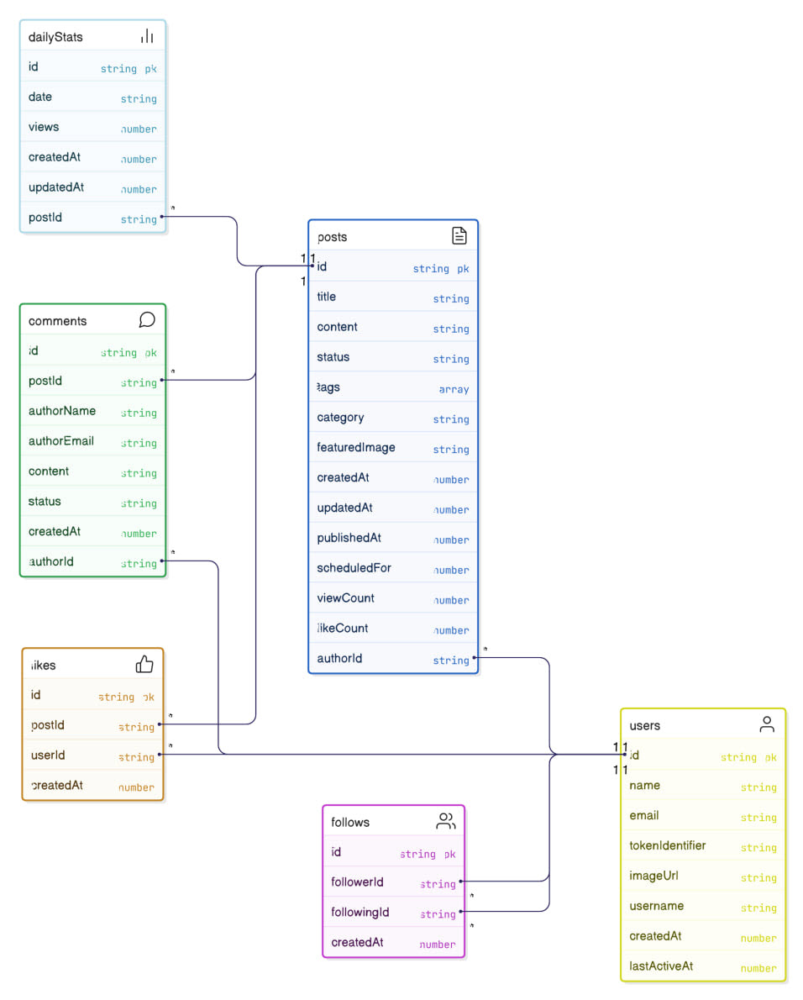

# AI Blog - Full Stack Next.js Project

This is a modern full-stack blog platform built with Next.js. This project leverages cutting-edge AI (powered by Google Gemini) to generate engaging blog content, optimize images with ImageKit, and deliver a sleek, responsive UI using Tailwind CSS and Shadcn UI components. This app makes it easy to create, manage, and share AI-assisted blog posts.

## Key features include:

- **AI-Powered Content Generation**: Use Gemini AI to draft blog posts, summaries, or ideas based on simple prompts.
- **Image Optimization & Upload**: Seamless integration with ImageKit for fast, responsive image handling.
- **Responsive Design**: Beautiful, mobile-first UI with Tailwind and customizable Shadcn components.
- **Full-Stack Architecture**: Server-side rendering with Next.js API routes for secure data handling.
- **Markdown Support**: Rich text editing for blog posts with syntax highlighting.

[Site](https://ai-blog-sxidsvit.vercel.app/)

## 🛠️ Tech Stack

- **Frontend**: [Next.js 14](https://nextjs.org/) (App Router), [React 18](https://reactjs.org/)
- **Styling**: [Tailwind CSS 3.4](https://tailwindcss.com/), [Shadcn UI](https://ui.shadcn.com/)
- **AI Integration**: [Google Gemini API](https://ai.google.dev/) (v2.5-flash for free tier text generation)
- **Image Handling**: [ImageKit](https://imagekit.io/) for uploads, transformations, and CDN delivery
- **Database**: [Convex](https://convex.dev/) (real-time backend for users, posts, and views)
- **Other**: TypeScript, ESLint, Prettier

## 📁 Project Structure

```
ai-blog/
├── app/                  # Next.js App Router pages and layouts
│   ├── api/              # API routes (e.g., /api/generate-post for AI calls)
│   ├── dashboard/        # Admin dashboard for managing posts
│   ├── layout.tsx        # Root layout with Tailwind and Shadcn providers
│   └── page.tsx          # Landing page
├── components/           # Reusable UI components (Shadcn-based)
│   ├── ui/               # Shadcn UI primitives (Button, Card, etc.)
│   ├── ai-generator.tsx  # AI content generation form
│   └── blog-post.tsx     # Blog post renderer with Markdown
├── lib/                  # Utilities and configurations
│   ├── convex/           # Convex schema and queries (e.g., getDailyViews)
│   ├── imagekit.ts       # ImageKit client setup
│   └── gemini.ts         # Gemini API wrapper
├── public/               # Static assets
├── convex/               # Convex backend (schemas, functions)
│   └── dashboard.ts      # Authenticated queries like getDailyViews
├── tailwind.config.js    # Tailwind configuration
├── next.config.js        # Next.js config (with ImageKit loader)
├── package.json          # Dependencies and scripts
└── README.md             # This file!
```

## ✨ Features

- **AI Blog Generation**: Input a topic, and Gemini generates full posts with SEO-friendly titles, intros, and conclusions.
- **Dashboard Analytics**: Track daily views and user engagement using Convex real-time data.
- **Image Management**: Upload and auto-optimize images via ImageKit for faster load times.
- **User Authentication**: Secure login with Convex auth (integrates with Google or email).
- **SEO Optimized**: Built-in meta tags, sitemaps, and Open Graph support.
- **Dark Mode**: Toggleable theme with Shadcn UI.

## 🚀 Quick Start

### Prerequisites

- Node.js 18+
- Google Gemini API Key (free tier available at [ai.google.dev](https://ai.google.dev))
- ImageKit Account and Keys (sign up at [imagekit.io](https://imagekit.io))
- Convex Project (create at [dashboard.convex.dev](https://dashboard.convex.dev))

---

## 

---

## DB Structure

---



---

### Installation

1. Clone the repo:

   ```
   git clone https://github.com/sxidsvit/ai-blog.git
   cd ai-blog
   ```

2. Install dependencies:

   ```
   npm install
   ```

3. Set up environment variables in `.env.local`:

```
CONVEX_DEPLOYMENT=
NEXT_PUBLIC_CONVEX_URL=

NEXT_PUBLIC_CLERK_PUBLISHABLE_KEY=
NEXT_PUBLIC_CLERK_SIGN_IN_URL=
NEXT_PUBLIC_CLERK_SIGN_UP_URL=

CLERK_JWT_ISSUER_DOMAIN=

NEXT_PUBLIC_IMAGEKIT_URL_ENDPOINT=
NEXT_PUBLIC_IMAGEKIT_PUBLIC_KEY=
IMAGEKIT_PRIVATE_KEY=

GEMINI_API_KEY=

```

4. Run Convex dev server (in a new terminal):

```

npx convex dev

```

5. Start the development server:

```

npm run dev

```

Open [http://localhost:3000](http://localhost:3000) to view the app!

### Build for Production

```

npm run build
npm start

```

## 🔧 Development Scripts

- `npm run dev` — Start dev server
- `npm run build` — Build for production
- `npm run lint` — Run ESLint
- `npm run format` — Format with Prettier

## 📚 Usage Examples

### Generating a Blog Post

1. Navigate to `/dashboard/generate`.
2. Enter a prompt: "Write a blog about Canary Islands travel".
3. Click "Generate" — Gemini creates the content.
4. Upload images via ImageKit and publish!

### Viewing Analytics

- Log in to `/dashboard`.
- Query daily views with Convex (handles auth automatically).

## 📄 License

This project is licensed under the MIT License - see the [LICENSE](LICENSE) file for details.

## 🙏 Acknowledgments

- [Next.js](https://nextjs.org/) for the robust framework.
- [Shadcn UI](https://ui.shadcn.com/) for beautiful components.
- [Google Gemini](https://ai.google.dev/) for AI magic.
- [ImageKit](https://imagekit.io/) for image optimization.
- [Convex](https://convex.dev/) for real-time backend.
- [RoadsideCoder](https://www.youtube.com/@RoadsideCoder/) for his invaluable contributions

# Contact

Connect with the project maintainer:

[][linkedin]

[linkedin]: https://www.linkedin.com/in/sergiy-antonyuk/

For questions or feedback, open an issue on [GitHub](https://github.com/sxidsvit/ai-blog/issues)

---

_Built with ❤️ by [sxidsvit](https://github.com/sxidsvit)_
_Last updated: September 29, 2025_

```

```
